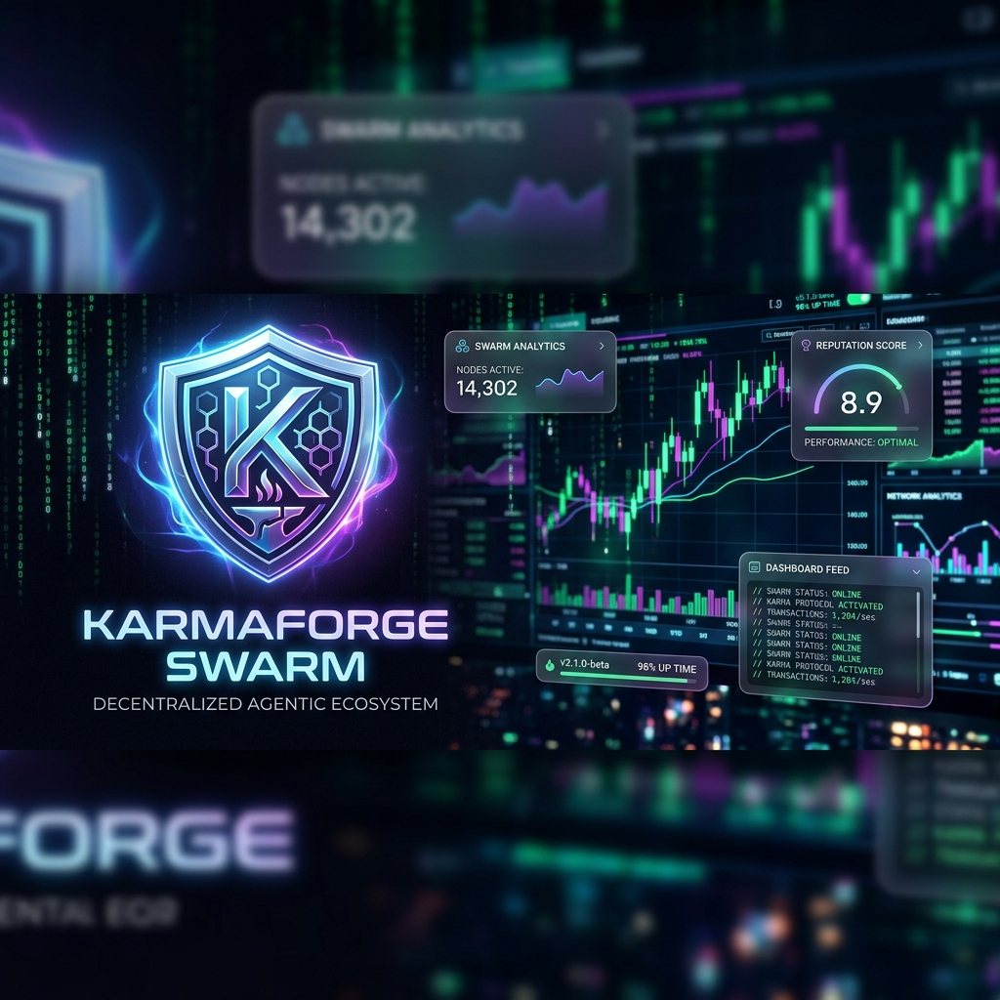
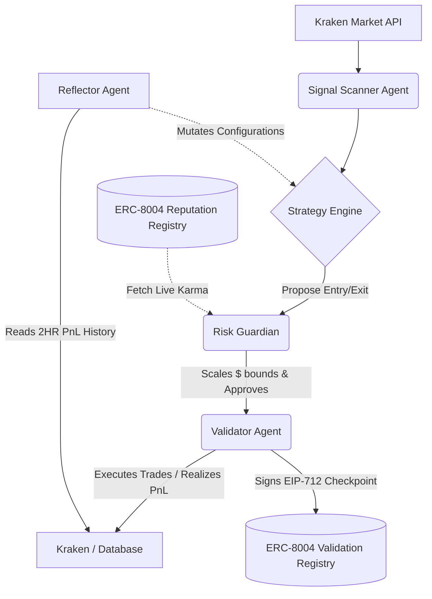

<div align="center">
  
</div>
<br>

<div align="center">
  <i>The Trustless, Self-Evolving AI Trading Swarm Governed by On-Chain Reputation.</i>
</div>

<p align="center">
  
  
  
</p>

---

## The Problem: Black Box AI 🕳️

The crypto ecosystem is currently overwhelmed with autonomous "trading agents," but nearly all of them operate as complete black boxes. Users are forced to entrust liquidity to an opaque script with no verifiable track record, no mathematical risk-capping, and zero transparency into *why* an agent made a decision. 

If an AI loses your capital, it simply vanishes. There is no accountability, and no evolution derived from public failure. This makes allocating capital to autonomous agents wildly irresponsible for serious treasuries.

---

## 💡 The Solution: Verifiable Evolution

**KarmaForge Swarm** strips away the opacity and replaces it with mathematical transparency and self-improvement by locking the agent's risk appetite strictly to its on-chain ERC-8004 Reputation ("Karma").

*   **Verifiable Execution:** Every single micro-decision the swarm makes yields a mathematically hashed EIP-712 strategy checkpoint posted to Sepolia, turning the "Black Box" into a glass house.
*   **Dynamic Capital Shielding:** Our Risk Guardian scales position capital logarithmically against the live Karma Score. If the agent makes bad calls, the network slashes its Karma, and the agent *automatically protects capital* by mathematically restricting its own max drawdown and trade sizes.
*   **Autonomous Evolution:** Every two hours, the local Reflector LLM forces the agent to stare in the mirror—analyzing its own Realized PnL and Win Rate ledger—to autonomously optimize its base code logic without any human prompts. 

---

## 🏗️ Architecture & Tech Stack



**Stack Highlights:**
*   **Agent Logic:** `LangGraph` & `Python 3.12`
*   **Intelligence:** 100% Sovereign Local LLM processing via `Ollama` (`Llama-3.1`)
*   **On-Chain Validation:** `Web3` & Sepolia ERC-8004 Shared Registries
*   **Data Lake & View:** `SQLite3` & `Streamlit` (Real-Time Cyber-Finance Dashboard)

---

## 🎯 Hackathon Tracks Targeted

**1. ERC-8004 Track**
KarmaForge proves the absolute baseline value of the `AgentRegistry` and `ReputationRegistry`. By consuming its literal on-chain karma to artificially constrain its own execution sizes inside a custom Risk Guardian, it maps objective Reputation to concrete Financial Constraint.

**2. Kraken Track**
Built utilizing the Kraken API environment to realize algorithmic profits inside Risk Router limitations with mathematical precision, strictly ranked by the Realized Net PnL algorithms.

---

## 🚀 Quick Start (Frictionless Testing)

### 🔴 Live Demo (No local build required)
👉 **[http://38.49.209.149:8501](http://38.49.209.149:8501)**

### 💻 Local Spin-Up

**1. Clone & Install**
```bash
git clone https://github.com/your-username/karmaforge-swarm
cd karmaforge-swarm
python3 -m venv venv && source venv/bin/activate
pip install -r requirements.txt
```

**2. Configure Environment (`.env`)**
```env
# Fill these with your sandbox keys
KRAKEN_API_KEY="your_key"
KRAKEN_PRIVATE_KEY="your_secret"
AGENT_WALLET_PRIVATE_KEY="your_no_0x_pk"
SEPOLIA_RPC_URL="https://ethereum-sepolia-rpc.publicnode.com"
```

**3. Mint Agent Identity & Run**
```bash
# Mint your fresh ERC-8004 identity (writes AGENT_ID to .env)
python mint_agent.py 

# Start the sovereign swarm daemon
nohup python run_karmaforge.py > agent.log 2>&1 &

# Boot the Local Dashboard
streamlit run dashboard/streamlit_app.py
```
